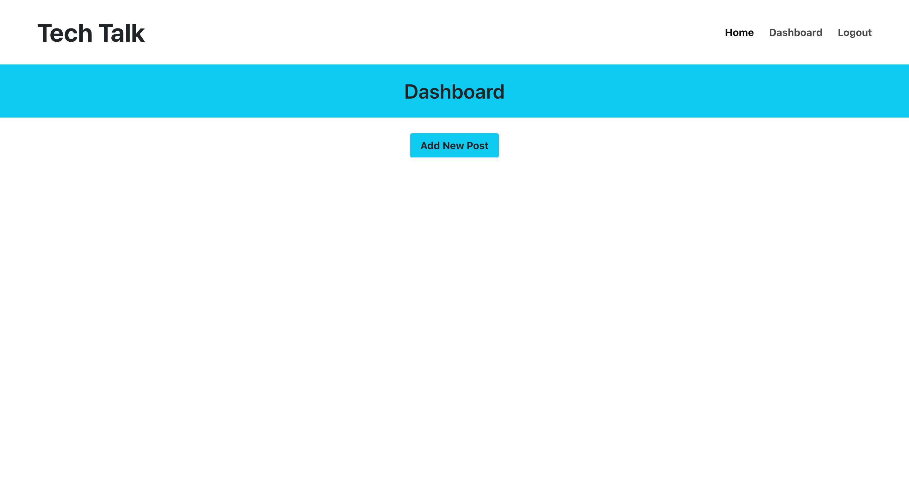

# tech-blog
14-MVC

## Table of Contents
1. [Description](#description)
2. [Submission](#submission)
3. [Usage](#usage)
4. [Visuals](#visuals)

## Description
This application is a CMS-style tech blog where developers can publish their blog posts, add comments, update, and delete their post.

[GitHub Repo](https://github.com/BrandyM98/tech-blog)

## Submission

[Heroku Link]()

## Usage
This application starts in the vscode terminal. The following commands have to be ran.
- npm i express-handlebars
- npm i mysql2
- npm i sequelize
- npm i dotenv
- npm i bcrypt
- npm i express-session
- npm i connect-session-sequelize

## Visuals
Here is a visual of the front-end of the webpage design!

